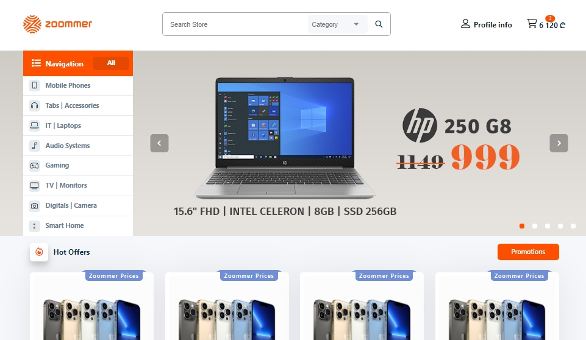

# Zoommer Home Page Clone

A pixel-perfect clone of the Zoommer homepage, built to practice HTML, CSS, and JavaScript skills. This project aims to replicate the design and functionality of the original Zoommer homepage, providing a visually appealing and responsive user experience.

## Features

- **Responsive Design**: Ensures the website looks great on all devices, including desktops, tablets, and mobile phones.
- **Interactive Elements**: Includes interactive elements such as dropdown menus, carousels, and buttons.
- **CSS Animations**: Utilizes CSS animations to enhance user interactions.
- **Modern UI/UX**: Follows modern UI/UX principles for a clean and user-friendly design.

## Technologies Used

- **HTML**: For structuring the content on the web.
- **CSS**: For styling the application.
  - Flexbox and Grid: For layout structure.
  - Media Queries: For responsive design.
  - CSS Animations: For interactive and engaging UI elements.
- **JavaScript**: For adding interactivity and dynamic content.

## Getting Started

### Prerequisites

You need a modern web browser to run this application.

### Installation

1. Clone the repository:
    ```bash
    git clone https://github.com/gabriel-pipia/zoommer-home-page-clone.git
    ```

2. Navigate to the project directory:
    ```bash
    cd zoommer-home-page-clone
    ```

3. Open `index.html` in your favorite web browser.

## Project Structure

- `index.html`: Main HTML file.
- `styles.css`: CSS file for styling the application.
- `script.js`: JavaScript file for handling application logic and interactivity.
- `README.md`: Project documentation.

## Screenshots




## Live Demo

Check out the live demo of the application: [Zoommer Home Page Clone](https://gp-zoommer-clone-home-page.netlify.app)

## License

This project is licensed under the MIT License. See the [LICENSE](LICENSE) file for details.

## Acknowledgements

- The original [Zoommer](https://www.zoommer.ge) website for design inspiration.
- [Font Awesome](https://fontawesome.com/) for icons.

## Author

Gabriel Pipia
- [GitHub](https://github.com/gabriel-pipia)

Feel free to contribute, open issues, or provide feedback!

---

Thank you for checking out this project!